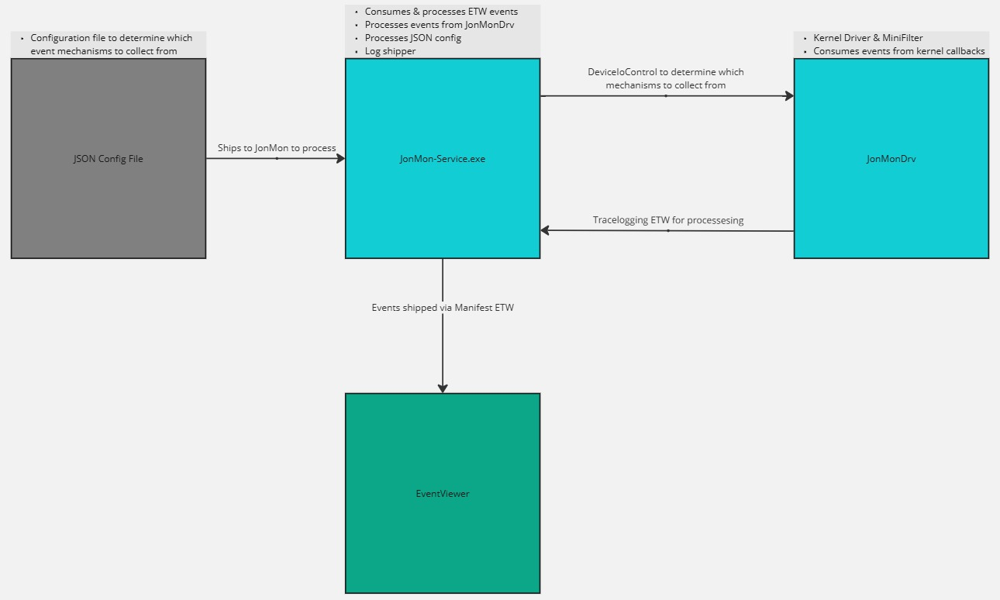

# JonMon v2.0
JonMon is a research project I started to help me learn how to code and understand telemetry mechanisms. It is a collection of open-source telemetry sensors designed to provide users with visibility into the operations and activity of their Windows systems. JonMon has a  kernel-level driver component, which is designed to collect information related to system operations such as process creation, registry operations, file creates and more.

In addition to the kernel-level driver component, JonMon also features a user-mode component that collects information about .NET, RPC, network activity, and other important system events. By combining data from both the kernel-level and user-mode components, JonMon provides users with a comprehensive view of their security activity.

The data collected by both components is made easily accessible to users through the Windows event log, allowing users to quickly and easily query the data and gain insights into their system operations. 

JonMon started and will continue to be a research project that allows for easy telemetry testing and verification.

## Disclaimer
JonMon v2.0 is a research project and is not meant to run in production environments and is not guaranteed to work. Any issues you might have, please submit a detailed issue and I will take a look when I have time.

Being that this is a project to help me learn how to code, I understand some things will not be perfect and there will be bugs. Issues are welcome, but may not always be addressed. 

# JonMon Guide
For all things on JonMon, please visit the [wiki](https://github.com/jsecurity101/JonMon/wiki#installation).  

### Quick Links
* [Installation](https://github.com/jsecurity101/JonMon/wiki#installation)
* [Event Mapping](https://github.com/jsecurity101/JonMon/wiki/Event-Mapping)
* [JonMon Configuration File](https://github.com/jsecurity101/JonMon/wiki/JonMon-Configuration-File)

### JonMon Diagram

# External Libraries
* [json by nlohmann](https://github.com/nlohmann/json)

# Acknowledgement
A special thanks to the following people for either testing out JonMon or giving programming/debugging guidance: 
* [Olaf Hartong](https://x.com/olafhartong)
* [Connor McGarr](https://x.com/33y0re)

